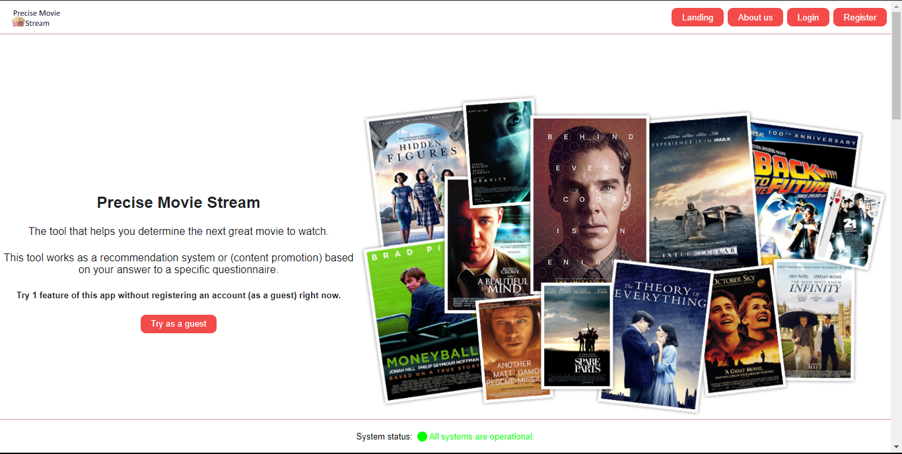

# Precise Movie Stream (a movie recommendation system)
------------------------------------------------------

#### Introduction:
     This is a movie recomemndation system. the algorithm this app is based on is not a machine learing algorithm.
     instead we developed a search based algorithm. (it's planned to implemend a machine learning algorithm in the future).

You can find the deployed app in here: http://pms.losag.tech

#### Project features:
      This project has the following features:
            -> technical features:
                  - full authentication system (login / register).
                  - password reset logic (with link validity check).
                  - mysql db storage engine.
                  - email sending functionality (using mailtrap smtp server) [you will need your milt_trap password set as a shell variable ('MAILTRAP_PASSWORD')].
                  - back-end data checks (data passed via the front-end app is being checked in the back-end).
                  - external api data fetching.
            -> system features:
                  - get random movies (10 each eretation).
                  - get public data about a movie or a serie.
                  - submit your interests to get a list of recommended movies.
            
#### project structure:
      The structure of this project is as fellows:
            |-> models
                  |-> storage_engine (this contains the Database Model)
                  | (all the models of this app)
            |-> api
                  |-> v1
                        |-> views (this contains the views defined for this project).
            |-> react-frontend (this has the front_end files (react JS))
            |-> app_production (this has a modfied version of the code [excluding the front_end folder] that is thread safe and compatible with gunicorn WSGI server).
                  NOTE: running the production app using `python3 -m` command will throw errors since python and gunicorn handle model importation diffirentelly. 

#### project dependencies:
      This project depends on the following packages:
            For flask back-end:
                  -> flasgger==0.9.7.1
                  -> Flask==3.0.2
                  -> Flask-Cors==4.0.0
                  -> Flask-Mail==0.9.1
                  -> Flask-SQLAlchemy==3.1.1
                  -> mysqlclient==2.1.1
            For the front-end: (created using vite)
                  -> axios (requests [fetch alternative])
                  -> npm (10.2.4) and node (v >= v20.11.0)
            For the database, we have the following configurations:
                  -> database type: Mysql relational database
                  -> database name: apms_dev
                  -> mysql user: 'pms_user'@'localhost'
                  -> mysql user password: 'pms_Passw0rd' (these configurations can be found in the app model)
            The external api used in this projest is OMDB api.

#### Installation:
      To run this project install the project dependencies using python `pip` or `pip3`, then:
            -> install mysql database (version 8), and configure it based on the above instructions (for databae dependencies).
            -> get in the react_frontend folder and run : ~react_frontend$ `npm run dev`.
            -> open other termninal and navigate to the repository root folder. and run: ~preciseMovieStream$ `python3 -m api.v1.app`.
            The api path will be : 'http://localhost:5000/api/v1/'

#### Usage
      Once the front-end and the back-end are running correctelly, navigate in your browser to : "http://localhost:5173/"
      -> this will open a user interface and go from there.

#### Contributing
      Mohamed Amouch - skyied.med2023@gmail.com

#### Related projects
      No related projects to this project on this github account for now.

#### Licensing
      Licenced under GNU General Public License (GPL).
